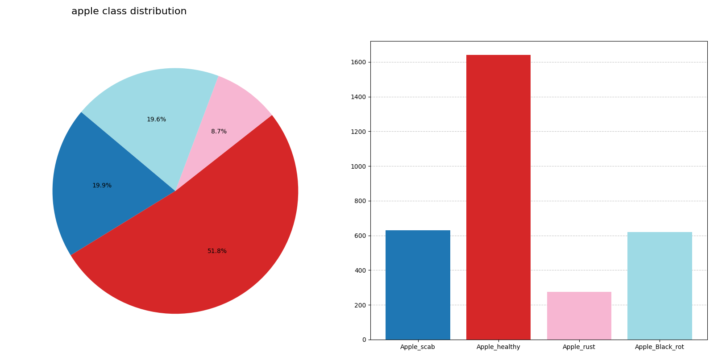
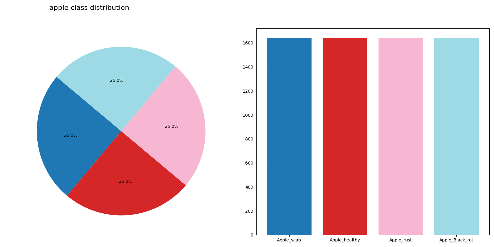
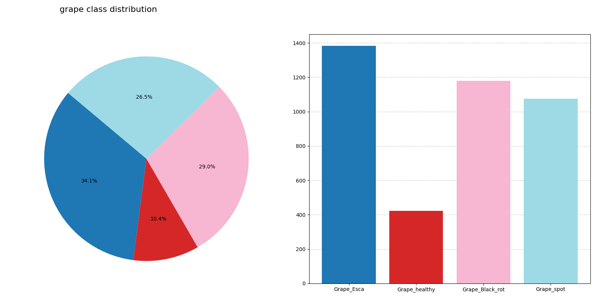
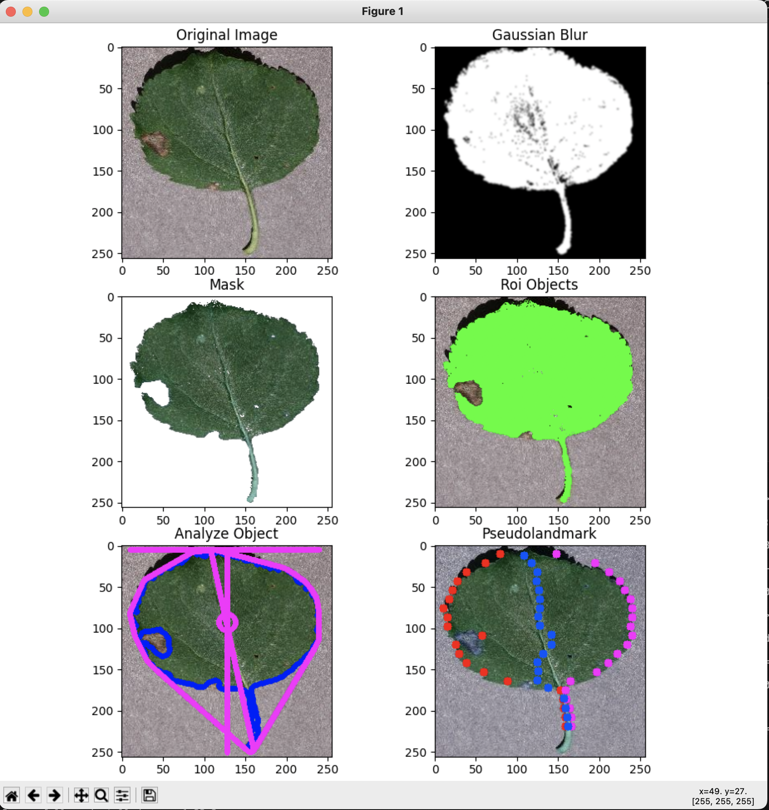
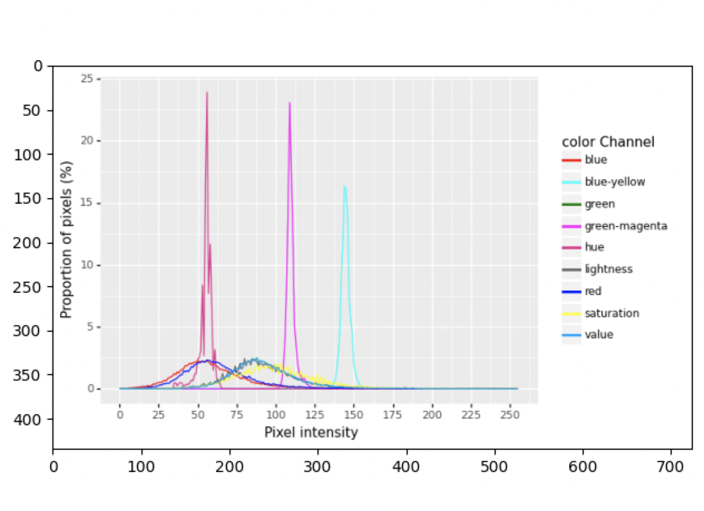
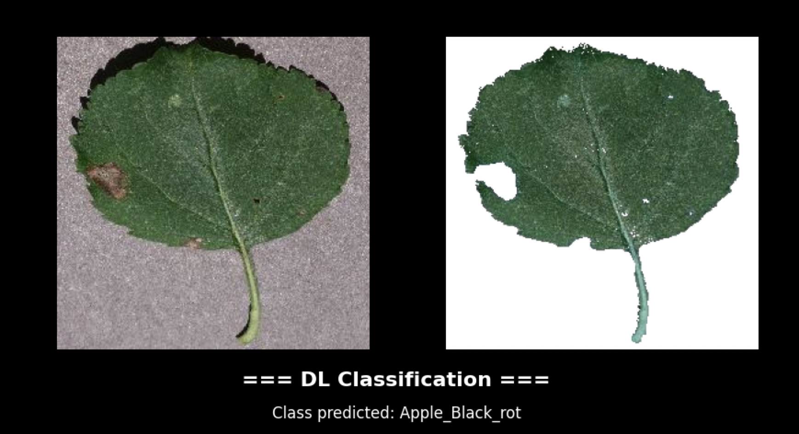
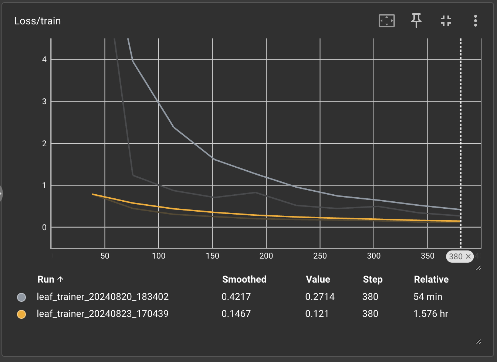
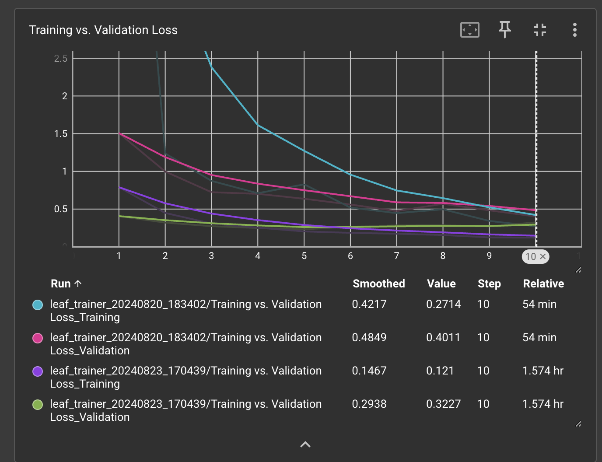

# leaffliction

An innovative computer vision project utilizing leaf image analysis for disease recognition.

## How to use

### Download dataset

```bash
# Download image dataset and generate distribution chart image
python 01.Distribution.py apple grape
```

### Data augmentation

```bash
# Augment unbalanced image dataset
python 02.Augmentation.py
```

```
Auto image augmentation...

Augmenting "Apple" images...
========================
Summary of augmentation:
========================
/Users/woolim/Documents/leaffliction/images/Apple_scab: 629 -> 1640
/Users/woolim/Documents/leaffliction/images/Apple_healthy: 1640 -> 1640
/Users/woolim/Documents/leaffliction/images/Apple_rust: 275 -> 1640
/Users/woolim/Documents/leaffliction/images/Apple_Black_rot: 620 -> 1640

Augmenting "Grape" images...
========================
Summary of augmentation:
========================
/Users/woolim/Documents/leaffliction/images/Grape_Esca: 1382 -> 1382
/Users/woolim/Documents/leaffliction/images/Grape_healthy: 422 -> 1382
/Users/woolim/Documents/leaffliction/images/Grape_Black_rot: 1178 -> 1382
/Users/woolim/Documents/leaffliction/images/Grape_spot: 1075 -> 1382
```

# Check image distributions are well balanced

```bash
python 01.Distribution.py apple grape
```

|           apple before            |          apple after           |
| :-------------------------------: | :----------------------------: |
|  |  |

|            grape before            |          grape after           |
| :--------------------------------: | :----------------------------: |
|  |  |

# Save transformed image plot

```bash
python 03.Transformation.py -src [SRC_PATH] -dst [DST_PATH]
```

|           image transformed            |           image transformed            |
| :------------------------------------: | :------------------------------------: |
|  |  |

# Predict an image

```bash
python predict.py [image_path]
```



# Predict all images and check prediction accuracy.

```bash
python 04.Classification.py
```

```
Validation Progress: 100%|███████████████████████████████████████████| 10/10 [01:10<00:00,  7.01s/it]
Accuracy of the model on the validation set: 92.31%
```

## Tensorboard

```bash
tensorboard --logdir runs
```

|         Train loss         |         Train vs Validation Loss         |
| :------------------------: | :--------------------------------------: |
|  |  |

## Resources

- [Youtube Coursera CNN](https://www.youtube.com/playlist?list=PLkDaE6sCZn6Gl29AoE31iwdVwSG-KnDzF)
